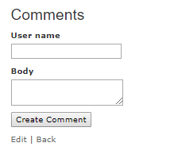

# Part 4: Allow Comments on your App

We are going to add the possibility to comment on ideas in your Rails Girls application.

The instructions for installing rails and building the ideas app can be found [here](part-1-build-your-first-app.md).

### 1. Create comment scaffold {#1-create-comment-scaffold}

Create a comment scaffold, with the commentator name, the comment body \(contents of the comment\) and with the reference to the ideas table \(`idea_id`\).

```text
rails g scaffold comment user_name:string body:text idea_id:integer
```

This will create a migration file that lets your database know about the new comments table. Run the migrations using

```text
rails db:migrate
```

### 2. Add relations to models {#2-add-relations-to-models}

You need to make sure that Rails knows the relation between objects \(ideas and comments\). As one idea can have many comments we need to make sure the idea model knows that. Open `app/models/idea.rb` and below the row

```ruby
class Idea < ApplicationRecord
```

add

```ruby
has_many :comments
```

The comment also has to know that it belongs to an idea. So open `app/models/comment.rb` and below

```ruby
class Comment < ApplicationRecord
```

add the row

```ruby
belongs_to :idea
```

### 3. Render the comment form and existing comments {#3-render-the-comment-form-and-existing-comments}

Open `app/views/ideas/show.html.erb` and after the image\_tag

```ruby
<%= image_tag(@idea.picture_url, :width => 600) if @idea.picture.present? %>
```

add

```ruby
<h3>Comments</h3>
<% @comments.each do |comment| %>
  <div>    
    <strong><%= comment.user_name %></strong>    
    <br>    
    <p><%= comment.body %></p>    
    <p><%= link_to 'Delete', comment_path(comment), method: :delete, data: { confirm: 'Are you sure?' } %></p>  
  </div>
  <% end %>
  <%= render partial: 'comments/form', locals: { comment: @comment } %>
```

In `app/controllers/ideas_controller.rb` add to the show method

```ruby
@comments = @idea.comments.all
@comment = @idea.comments.build
```

Open `app/views/comments/_form.html.erb` and after

```ruby
  <div class="field">
    <%= form.label :body %><br>
    <%= form.text_area :body %>
  </div>
```

add the row

```ruby
<%= form.hidden_field :idea_id %>
```

next, remove

```ruby
<div class="field">
  <%= form.label :idea_id %><br>
  <%= form.number_field :idea_id %>
</div>
```

That’s it. Now view an idea you have inserted to your application and there you should see the form for inserting a comment as well as deleting older comments.



