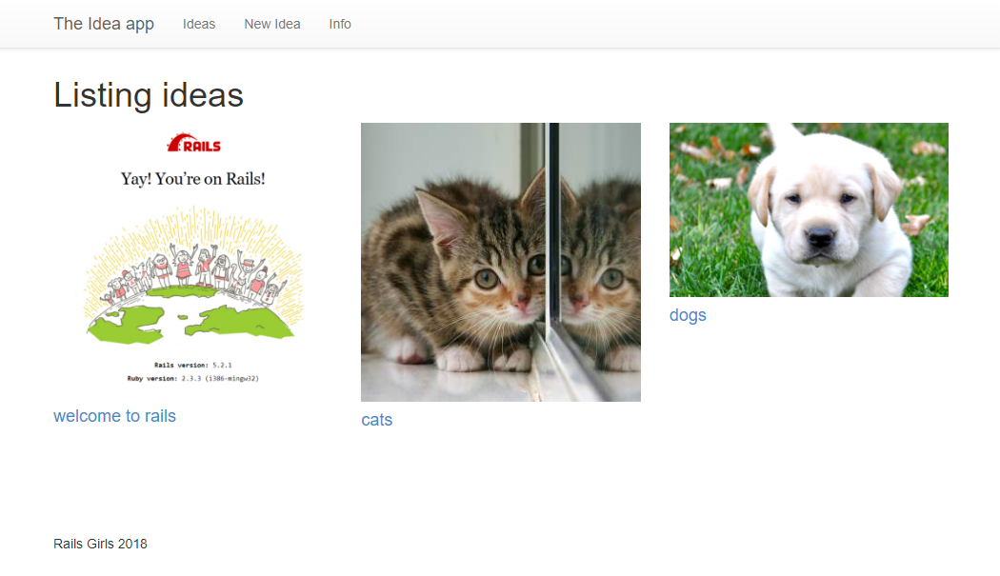
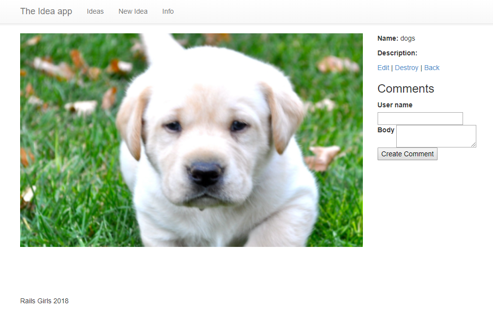

# Part 5: Add Design with HTML and CSS

Now the app is running well, but it still looks like scaffold. Let’s add some design to make it look like a professional website. When you’ve finished this tutorial, your app will look like [this](http://railsgirlsapp.herokuapp.com/ideas).

### 1. Adjust the application layout <a id="1-adjust-the-application-layout"></a>

Open `app/assets/stylesheets/application.css`, replace the line

```css
body { padding-top: 100px; }
```

with

```css
body { padding-top: 60px; }
```

Finally, delete the file `app/assets/stylesheets/scaffolds.scss` because we don’t really need the default style generated by Rails.

Now refresh the page at [http://localhost:3000/ideas](http://localhost:3000/ideas). You will not find much change but it’s good preparation for the following steps.

### 2**.** _****_Refine the navigation <a id="2-refine-the-navigation"></a>

Considering “idea” is the most important object in your app, we are going to put the “New Idea” button on the navigation bar to make it always available.

Open `app/views/layouts/application.html.erb`, under the line

```markup
<li class="active"><a href="/ideas">Ideas</a></li>
```

add

```markup
<li ><%= link_to 'New Idea', new_idea_path %></li>
```

### 3. Design the idea list <a id="3-design-the-idea-list"></a>

Now it’s time to make the idea list page look professional. For that, we are going to replace the table layout with a div layout.

**Coach:** Talk a little about table vs div.

Open `app/views/ideas/index.html.erb` in your text editor and replace all lines with

```markup
<h1>Listing ideas</h1>

<% @ideas.in_groups_of(3) do |group| %>
  <div class="row">
    <% group.compact.each do |idea| %>
      <div class="col-md-4">
        <%= image_tag idea.picture_url, width: '100%' if idea.picture.present? %>
        <h4><%= link_to idea.name, idea %></h4>
        <%= idea.description %>
      </div>
    <% end %>
  </div>
<% end %>
```

**Coach:** Explain what the new code means line by line, and talk a little about Bootstrap 12 grids layout.

Refresh it! We get a nice looking idea list. Click the “New Idea” button, and create more ideas with real text and pretty pictures - the page will look much better with content. There is a principle of contemporary web design: content is the best decoration.



### 4. Design t**he ide**a details page <a id="4-design-the-idea-details-page"></a>

Click the title of an idea, and you will be brought to the details page of the idea. Now it is still scaffold generated by Rails, so let’s make it better.

Open `app/views/ideas/show.html.erb` in your text editor and replace all lines with

```markup
<p id="notice"><%= notice %></p>

<div class="row">
  <div class="col-md-9">
    <%= image_tag(@idea.picture_url, width: '100%') if @idea.picture.present? %>
  </div>
  <div class="col-md-3">
    <p><b>Name: </b><%= @idea.name %></p>
     <p><b>Description: </b> <%= @idea.description %></p>
     <p>
       <%= link_to 'Edit', edit_idea_path(@idea) %> |
       <%= link_to 'Destroy', @idea, data: { confirm: 'Are you sure?' }, method: :delete %> |
       <%= link_to 'Back', ideas_path %>
     </p>
     <h3>Comments</h3><% @comments.each do |comment| %>
     <div>
       <strong><%= comment.user_name %></strong>
       <br>
       <p><%= comment.body %></p>
       <p><%= link_to 'Delete', comment_path(comment), method: :delete, data: { confirm: 'Are you sure?' } %></p>
     </div>
     <% end %>
     <%= render partial: 'comments/form', locals: { comment: @comment } %>
   </div>
 </div>

```

**Coach:** Explain what the new code means line by line.




### What next? <a id="what-next"></a>

* Use your new knowledge to design the new idea form
* Add more design to the pages as you wish
* Follow the other guides to learn more about Rails

