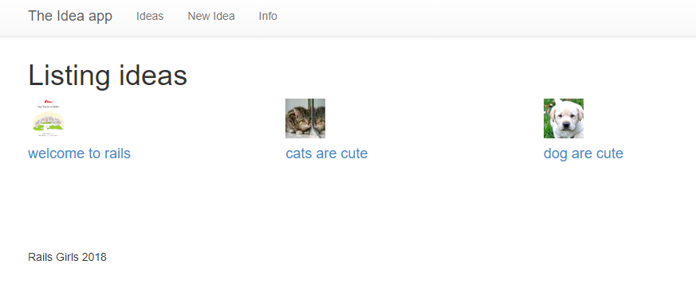

# Part 6: Create Thumbnails with CarrierWave

**Coach**: Explain what specifying the image width in HTML at the end of Part 4 does and how it differs from resizing images on the server.

### 1. Installing ImageMagick <a id="1-installing-imagemagick"></a>

* OS X: run `brew install imagemagick`. If you don’t have the brew command, you can [install Homebrew here](https://brew.sh/). After installation, close and reopen the terminal to make sure imagemagick is loaded correctly
* Windows: download and run the [ImageMagick installer](http://www.imagemagick.org/script/download.php#windows) \(use the first _download_ link\). In the installation wizard, make sure you check the checkbox to install legacy binaries. After installation, close and reopen GitBash, and Command Prompt with Ruby and Rails.
* Linux: On Ubuntu and Debian, run `sudo apt-get install imagemagick`. Use the appropriate package manager instead of `apt-get` for other distributions. After installation, close and reopen the terminal to make sure imagemagick is loaded correctly

**Coach**: What is ImageMagick and how is it different from libraries/gems we used before?

Open `Gemfile` in the project and add

```ruby
gem 'mini_magick', '4.8.0'
```

under the line

```ruby
gem 'carrierwave'
```

In the Terminal run:

```text
bundle
```

### 2. Telling our app to create thumbnails when an image is uploaded <a id="2-telling-our-app-to-create-thumbnails-when-an-image-is-uploaded"></a>

Open `app/uploaders/picture_uploader.rb` and find the line that looks like this:

```ruby
  # include CarrierWave::MiniMagick
```

Remove the `#` sign.

**Coach**: Explain the concept of comments in code.

Below the line you just changed, add:

```ruby
version :thumb do
  process :resize_to_fill => [50, 50]
end
```

The images uploaded from now on should be resized, but the ones we already have weren’t affected. So edit one of the existing ideas and re-add a picture.

### 3. Displaying the thumbnails <a id="3-displaying-the-thumbnails"></a>

To see if the uploaded picture was resized open `app/views/ideas/index.html.erb`. Change the line

```ruby
<%= image_tag idea.picture_url, width: '100%' if idea.picture.present? %>
```

to

```ruby
<%= image_tag idea.picture_url(:thumb) if idea.picture.present? %>
```

Take a look at the list of ideas in the browser to see if the thumbnail is there.



