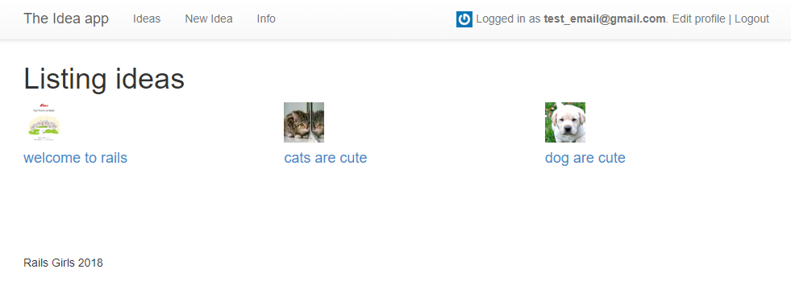

# Part 8: Add Profile Pics with Gravatar

#### Important {#important}

You need to have an e-mail address registered with Gravatar for this to work. If you do not already have one you can go to [gravatar.com](http://en.gravatar.com/).

### 1. Add the Gravtastic gem {#1-add-the-gravtastic-gem}

Open up your gemfile and under your `devise` gem add

```ruby
gem 'gravtastic'
```

In the terminal run

```text
bundle install
```

This will install the gravtastic gem. Then remember to restart your rails server.

### 2. Set up Gravatar in your app {#2-set-up-gravatar-in-your-app}

Open `app/models/user.rb`, and add these lines

```ruby
include Gravtastic
gravtastic
```

right after `class User < ApplicationRecord`.

### 3. Configure Gravatar {#3-configure-gravatar}

Open `app/views/layouts/application.html.erb` and right under

```ruby
<% if user_signed_in? %>
```

add

```ruby
<%= image_tag current_user.gravatar_url, size: "20x20" %>
```

Now open you app in your browser and login with an e-mail address that is associated with a Gravatar. You should be able to see your Gravatar.



  


